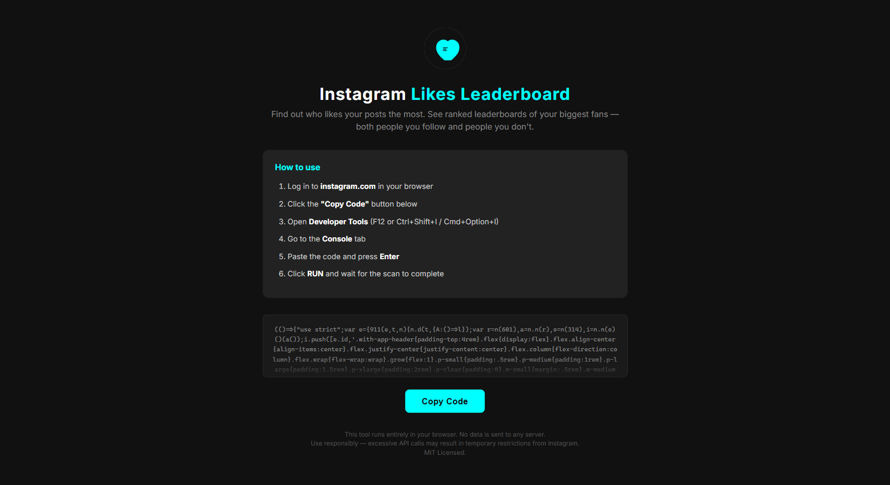
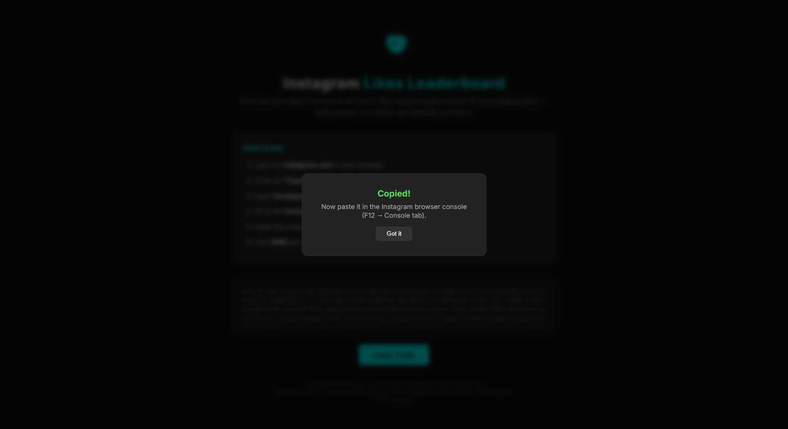

# Instagram Likes Leaderboard

Find out who likes your Instagram posts the most!

This tool scans your posts and shows you a **ranked leaderboard** of your biggest fans, a **stats dashboard** with engagement metrics, and a **follower analysis** showing who doesn't follow you back, ghost followers, and more.

**No downloads, no installations, no sign-ups.** Just copy-paste one line into your browser and go.

---

## How to Use (Step by Step)

### On Desktop (Chrome, Edge, Firefox)

1. **Open the tool page:** [https://sagargupta.online/InstagramLikesLeaderboard/](https://sagargupta.online/InstagramLikesLeaderboard/)

2. **Click the big "Copy Code" button** - this copies the script to your clipboard

    

3. **Go to Instagram** - open [instagram.com](https://www.instagram.com) and make sure you're logged in

4. **Open the browser console** - this is a hidden text box in your browser:
   - **Windows/Linux:** Press `Ctrl + Shift + J` (or `F12` then click "Console" tab)
   - **Mac:** Press `Cmd + Option + J`
   - You'll see a text area at the bottom of your screen - that's the console

5. **Paste the code** - click inside the console, press `Ctrl + V` (or `Cmd + V` on Mac), then press **Enter**

6. **Choose your analysis modes** - the tool will show checkboxes for:
   - **Likes Leaderboard** (always on) - ranked list of who likes your posts
   - **Stats Dashboard** - engagement metrics, top fans, most liked post
   - **Follower Analysis** - who doesn't follow back, ghost followers, mutuals

7. **Click RUN** - the scan begins in up to 4 steps:
   - Step 1: Collects all your posts
   - Step 2: Checks who liked each post (this is the longest step)
   - Step 3: Gets your following list
   - Step 4: Gets your followers list (only if Follower Analysis is selected)

   You'll see a progress bar and percentage for each step. You can **pause** anytime.

8. **View your results!** Switch between views using the top navigation bar.

### On Android Mobile

1. Download [Eruda Browser](https://github.com/liriliri/eruda-android/releases/) (free, lightweight browser with a built-in console)
2. Open instagram.com in Eruda Browser
3. Tap the Eruda floating icon to open the console
4. Follow the same steps as desktop (copy code from the tool page, paste in console, press Enter)

### On iPhone

Use Safari on your Mac to remotely debug Safari on your iPhone, or use a browser app that supports developer console (like Web Inspector on iOS).

---

## What You'll See

### Likes Leaderboard

Each person in the leaderboard shows:
- **Rank** - #1, #2, #3 get trophy icons (gold, silver, bronze)
- **Profile picture and username** - click to visit their profile
- **Like bar** - visual bar showing how many of your posts they liked (e.g., 45/80)
- **Percentage** - what percent of your posts they liked (e.g., 56.3%)
- **Hide button** - click X to remove a user from the list

### Stats Dashboard

Overview of your account engagement:
- **Total posts scanned** and **total likes** received
- **Average likes per post** and **engagement rate**
- **Follower/following ratio** and counts
- **Most liked post** with caption preview
- **Top 5 fans** - your biggest supporters at a glance

### Follower Analysis

Four tabs to understand your follower relationships:
- **Don't Follow Back** - people you follow who don't follow you
- **Not Following Back** - people who follow you but you don't follow
- **Mutual** - people you follow who also follow you back
- **Ghost Followers** - followers who have never liked any of your posts

### Sidebar Options (Leaderboard)
- **Filters** - hide verified/creator accounts, unhide hidden users
- **Sort** by like count, percentage, or username
- **Search** by name or username
- **Export** your data as a spreadsheet (CSV) or data file (JSON)
- **Pages** - navigate through results (50 per page)

### Settings (Gear Icon)
Before running a scan, click the gear icon to adjust timing settings. The default settings are safe for most accounts. Only change these if you know what you're doing - lowering the delays too much can cause Instagram to temporarily restrict your account.

### Load Previous Results
If you've run a scan before, the tool saves your results in your browser. Next time you open it, you'll see a "Load previous results" button that lets you jump straight to your data without scanning again.

---

## Important Notes

- **Your data stays private** - everything runs in YOUR browser. Nothing is sent to any server. No one can see your results.
- **Safe to use** - the tool only reads data (who liked your posts). It does NOT like, unlike, follow, unfollow, or modify anything on your account.
- **Be patient with large accounts** - if you have hundreds of posts, the scan will take a while because the tool intentionally pauses between requests to avoid Instagram rate limits.
- **You can pause and resume** at any time during the scan.
- **Results are saved** - your browser remembers your last scan, so you don't need to re-scan every time.
- **Works on Chrome, Edge, Firefox, and Brave** on desktop.

---

## FAQ

**Q: Is this safe? Will my account get banned?**
A: The tool uses the same requests your browser makes when you browse Instagram normally. It just automates the process. With the default timing settings, the risk is minimal. However, like any automation tool, use it at your own discretion.

**Q: Why does it take so long?**
A: The tool deliberately waits between requests to avoid triggering Instagram's rate limits. This protects your account. The more posts you have, the longer Phase 2 takes.

**Q: Why are some people showing 0 likes?**
A: The "Following" tab shows everyone you follow, including those who never liked any of your posts. This helps you see who doesn't engage with your content.

**Q: Can others see that I used this tool?**
A: No. The tool runs entirely in your browser. Instagram doesn't notify anyone.

**Q: Do I need to install anything?**
A: No. Just copy-paste the code into your browser console. No extensions, no downloads.

**Q: Will my previous results be lost if I clear my browser data?**
A: Yes. Results are stored in your browser's localStorage. Clearing site data for Instagram will remove saved results.

---

## Features

- Scan all your posts and see who liked them the most
- **Stats Dashboard** with engagement rate, avg likes, top fans, most liked post
- **Follower Analysis** - ghost followers, don't follow back, not following back, mutuals
- Two leaderboards: Following and Not Following
- Trophy icons for top 3 (gold, silver, bronze)
- Visual like-percentage bars
- Filter out verified/creator accounts
- Hide individual users from results
- Sort by likes, percentage, or username
- Search and filter results
- Export as CSV (spreadsheet) or JSON (data file)
- Adjustable scan speed settings
- Pause and resume scanning
- **Save and reload results** - no need to re-scan
- Progress display with percentage for each phase
- Dark theme interface
- Works on desktop and mobile
- 100% private - no data leaves your browser

---

## For Developers

- **Tech stack:** Preact + TypeScript + Webpack 5 + SCSS
- **Node version:** 16.14.0 (use `nvm use` if you have nvm)
- **Install:** `npm install`
- **Dev build:** `npm run build-dev`
- **Production build:** `npm run build`
- **API:** Uses Instagram's v1 REST API (`/api/v1/feed/user/`, `/api/v1/media/{id}/likers/`, `/api/v1/friendships/{id}/following/`, `/api/v1/friendships/{id}/followers/`)
- **Output:** Single minified JS bundle (~98KB) embedded in `public/index.html`
- **Deployment:** Auto-deploys to GitHub Pages on push to `master`

---

## Legal

**Disclaimer:** This tool is not affiliated with, endorsed by, or officially connected to Instagram or Meta.

Use at your own risk.

Licensed under the [MIT License](LICENSE) - free to use, copy, and modify.
